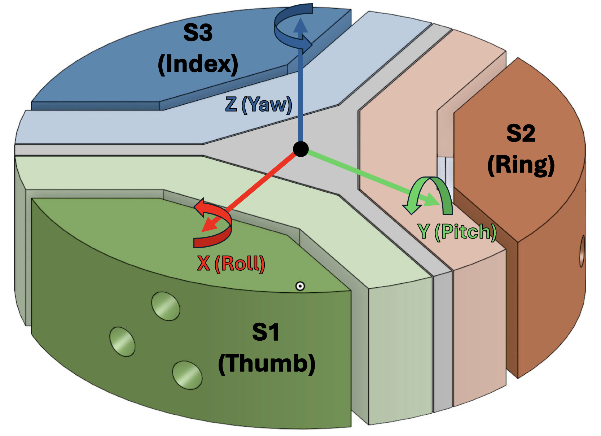

# Finger Manipulation Experiment Protocol
Sensor 1: FT44298 
Sensor 2: FT45281 
Sensor 3: FT44297 

NIDAQ Reading: (S1, S2) 
Labjack Reading: (S3) 
Main Reader Reading: Biased (S1, S2, S3) 

Gesture 1: 3 finger rotatory manipulation
<ul>
    <li> Thumb for Sensor 1</li>
    <li> Index for Sensor 3</li>
    <li> Ring for Senosr 2</li>
</ul>

For data access, please refer to:
`data/{rotation axis}/test_{number}`

The data structure of `raw_data.csv` is: 
$\textbf{[}S_1.F_x, S_1.F_y, S_1.F_z, S_1.\tau_x, S_1.\tau_y, S_1.\tau_z,$ 
$S_2.F_x, S_2.F_y, S_2.F_z, S_2.\tau_x, S_2.\tau_y, S_2.\tau_z,$ 
$S_3.F_x, S_3.F_y, S_3.F_z, S_3.\tau_x, S_3.\tau_y, S_3.\tau_z \textbf{]}$

The data structure of `transformed_data.csv` is: 
$\textbf{[}S_1.F_x, S_1.F_y, S_1.F_z,$ 
$S_2.F_x, S_2.F_y, S_2.F_z,$ 
$S_3.F_x, S_3.F_y, S_3.F_z \textbf{]}$

